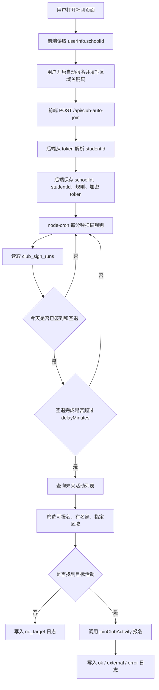

# 自动报名技术方案

## 1. 背景

当前项目已经具备社团活动列表、手动报名、取消报名、后端定时签到、后端定时签退等能力。

现有后端定时签到的核心链路是：

```text
前端保存签到 / 签退时间
  ↓
后端保存配置和加密 token
  ↓
server 常驻运行
  ↓
node-cron 每分钟扫描
  ↓
到点后后端调用签到 / 签退接口
  ↓
写入执行日志
```

自动报名功能要在这个基础上继续扩展：

```text
完成签到 + 签退
  ↓
等待指定时间，默认 60 分钟
  ↓
后端自动查询后续活动
  ↓
筛选指定区域、有名额、可报名的活动
  ↓
后端自动报名
  ↓
写入自动报名日志
```

本方案采用 **方案 A：保存配置时前端传 `schoolId`**。

---

## 2. 目标

实现一个后端自动报名系统，满足：

```text
1. 用户主动开启自动报名。
2. 用户可以配置指定区域关键词。
3. 用户可以配置签退后延迟多久报名，默认 60 分钟。
4. 前端保存配置时把 schoolId 传给后端。
5. 后端页面关闭后仍然可以自动执行。
6. 后端只报名有名额、可报名、符合区域条件的活动。
7. 每次自动报名都有日志。
8. 支持查询今天自动报名是否成功。
```

---

## 3. 非目标

第一版不做这些：

```text
1. 不做多账号管理后台。
2. 不做短信、微信、邮件通知。
3. 不做地图距离计算。
4. 不做复杂活动优先级。
5. 不做高频抢名额。
6. 不绕过平台规则。
```

第一版只实现稳定、可解释、可记录的后端自动报名。

---

## 4. 技术栈

### 4.1 前端

| 技术 | 用途 |
| --- | --- |
| Vue 3 | 社团页面和自动报名配置 UI |
| Vite | 前端构建和环境变量注入 |
| Axios / fetch | 调用校园跑接口和自建后端接口 |
| Tailwind CSS | 页面样式 |

前端主要负责：

```text
1. 展示自动报名配置入口。
2. 读取当前用户 schoolId。
3. 读取当前用户 token。
4. 把自动报名规则同步到后端。
5. 展示配置保存结果。
```

前端不负责真正定时执行自动报名。

---

### 4.2 后端

| 技术 | 用途 |
| --- | --- |
| Node.js | 后端运行环境 |
| Express | 提供自动报名配置 API |
| node-cron | 每分钟扫描自动报名任务 |
| sql.js / SQLite | 保存规则和执行日志 |
| Luxon | 处理时区和时间计算 |
| crypto | token 加密和请求签名 |
| PM2 | 服务器上保持后端常驻运行 |

后端主要负责：

```text
1. 保存自动报名规则。
2. 加密保存 token。
3. 每分钟扫描是否满足自动报名条件。
4. 查询活动列表。
5. 筛选目标活动。
6. 调用报名接口。
7. 写入自动报名日志。
```

---

### 4.3 部署

| 技术 | 用途 |
| --- | --- |
| GitHub | 代码同步 |
| Linux 服务器 | 长期运行后端 |
| PM2 | 后端进程守护 |
| Nginx | 托管前端和反向代理 |

推荐生产部署形态：

```text
Nginx 80 / 443
  ├─ 前端静态文件 app/dist
  └─ /api/club-schedules、/api/club-auto-join 反向代理到 127.0.0.1:8787

PM2
  └─ server/index.js 常驻运行
```

---

## 5. 方案 A：前端保存配置时传 schoolId

后端自动查询活动列表时需要：

```text
queryTime
schoolId
studentId
pageNo
pageSize
```

当前前端已经有用户信息：

```js
userInfo.value?.schoolId
userInfo.value?.studentId
```

因此保存自动报名配置时，前端直接把 `schoolId` 发给后端。

后端不要信任前端传来的 `studentId`，而是从 token 解析：

```text
token 请求头
  ↓
fetchStudentIdFromToken(token)
  ↓
得到 studentId
```

后端保存：

```text
student_id：从 token 解析
school_id：前端保存配置时传入
token_enc：加密后的 token
```

这样自动报名时，后端可以直接使用：

```text
rule.school_id
rule.student_id
```

去查询活动列表。

---

## 6. 总体流程



---

## 7. 核心实现原理

### 7.1 为什么必须由后端执行

浏览器页面关闭后，前端 JavaScript 不会继续运行。

如果用前端定时器：

```text
window.setTimeout
setInterval
localStorage
```

会有这些问题：

```text
1. 页面关闭后不执行。
2. 浏览器休眠后不执行。
3. 手机后台可能被系统挂起。
4. 错过时间后无法可靠补偿。
```

后端常驻进程可以解决这些问题：

```text
1. 页面关闭后仍然运行。
2. 可以每分钟扫描。
3. 可以持久化任务状态。
4. 可以记录成功和失败日志。
5. 可以避免重复执行。
```

---

### 7.2 自动报名触发条件

自动报名不应该随时执行，而应满足：

```text
1. 自动报名规则 enabled = 1。
2. 今天已经完成签到。
3. 今天已经完成签退。
4. 当前时间 >= 签退完成时间 + delayMinutes。
5. 今天还没有自动报名成功记录。
6. 能找到符合条件的活动。
```

判断链路：

```text
club_auto_join_rules.enabled = 1
  ↓
club_sign_runs 中存在 sign_in 且 status in ('ok', 'external')
  ↓
club_sign_runs 中存在 sign_out 且 status in ('ok', 'external')
  ↓
sign_out.created_at + delay_minutes <= now
  ↓
club_auto_join_runs 今天没有 ok / external 记录
  ↓
执行自动报名
```

`external` 表示：

```text
后端触发时发现该动作已经由手动或其他入口完成。
```

所以它也可以算作“已完成”。

---

### 7.3 如何筛选目标活动

后端查询活动列表后，需要筛选：

```text
1. 可报名。
2. 有名额。
3. 符合指定区域。
4. 不包含排除关键词。
5. 时间排序后取下一个活动。
```

当前项目里活动状态大致是：

| optionStatus | 含义 |
| --- | --- |
| `6` | 可报名 |
| `1` | 已报名 |
| `7` | 报名已满 |
| `3` | 无法报名 |
| `4` | 已完成 |

所以第一层筛选：

```js
String(activity.optionStatus) === '6'
```

名额判断：

```js
const joined = Number(activity.joinStudentNum ?? activity.signInStudent);
const total = Number(activity.maxStudent ?? activity.studentNum);
const hasCapacity = !Number.isFinite(joined) || !Number.isFinite(total) || total <= 0 || joined < total;
```

区域匹配字段：

```text
activityName
address
addressDetail
```

区域关键词示例：

```json
["航空港", "二田径场"]
```

第一版推荐使用 OR 模式：

```text
命中任意一个关键词即可。
```

---

## 8. 数据库设计

### 8.1 自动报名规则表

新增表：

```sql
CREATE TABLE IF NOT EXISTS club_auto_join_rules (
  id INTEGER PRIMARY KEY AUTOINCREMENT,

  student_id INTEGER NOT NULL UNIQUE,
  school_id INTEGER NOT NULL,

  token_enc TEXT NOT NULL,

  enabled INTEGER NOT NULL DEFAULT 0,

  area_keywords TEXT NOT NULL DEFAULT '',
  exclude_keywords TEXT NOT NULL DEFAULT '',

  delay_minutes INTEGER NOT NULL DEFAULT 60,
  max_days_ahead INTEGER NOT NULL DEFAULT 7,
  prefer_earliest INTEGER NOT NULL DEFAULT 1,

  timezone TEXT NOT NULL DEFAULT 'Asia/Shanghai',

  created_at TEXT NOT NULL DEFAULT (datetime('now')),
  updated_at TEXT NOT NULL DEFAULT (datetime('now'))
);
```

字段说明：

| 字段 | 说明 |
| --- | --- |
| `student_id` | 学生 ID，从 token 解析 |
| `school_id` | 学校 ID，由前端保存配置时传入 |
| `token_enc` | 加密后的 token |
| `enabled` | 是否启用自动报名 |
| `area_keywords` | 指定区域关键词，JSON 字符串 |
| `exclude_keywords` | 排除关键词，JSON 字符串 |
| `delay_minutes` | 签退后延迟多少分钟执行 |
| `max_days_ahead` | 最多查未来几天活动 |
| `prefer_earliest` | 是否优先报名最早的活动 |
| `timezone` | 时区 |

---

### 8.2 自动报名执行日志表

新增表：

```sql
CREATE TABLE IF NOT EXISTS club_auto_join_runs (
  id INTEGER PRIMARY KEY AUTOINCREMENT,

  rule_id INTEGER NOT NULL,
  student_id INTEGER NOT NULL,
  school_id INTEGER NOT NULL,

  run_date TEXT NOT NULL,

  status TEXT NOT NULL,
  message TEXT,

  selected_activity_id INTEGER,
  selected_activity_name TEXT,
  selected_activity_time TEXT,
  selected_activity_area TEXT,

  created_at TEXT NOT NULL DEFAULT (datetime('now')),

  FOREIGN KEY (rule_id) REFERENCES club_auto_join_rules(id) ON DELETE CASCADE
);
```

状态设计：

| status | 含义 |
| --- | --- |
| `running` | 正在执行 |
| `ok` | 自动报名成功 |
| `no_target` | 没找到符合条件的活动 |
| `external` | 已经手动报名或外部完成 |
| `error` | 执行失败 |

---

## 9. 后端接口设计

新增路由：

```text
server/routes/clubAutoJoin.js
```

挂载路径：

```text
/api/club-auto-join
```

---

### 9.1 查询当前规则

```http
GET /api/club-auto-join/me
token: 用户 token
```

返回：

```json
{
  "ok": true,
  "rule": {
    "studentId": 3640977,
    "schoolId": 12345,
    "enabled": true,
    "areaKeywords": ["航空港", "二田径场"],
    "excludeKeywords": ["线上"],
    "delayMinutes": 60,
    "maxDaysAhead": 7,
    "preferEarliest": true,
    "timezone": "Asia/Shanghai"
  }
}
```

---

### 9.2 保存规则

```http
POST /api/club-auto-join
token: 用户 token
Content-Type: application/json
```

请求体：

```json
{
  "schoolId": 12345,
  "enabled": true,
  "areaKeywords": ["航空港", "二田径场"],
  "excludeKeywords": ["线上", "讲座"],
  "delayMinutes": 60,
  "maxDaysAhead": 7,
  "preferEarliest": true,
  "timezone": "Asia/Shanghai"
}
```

后端处理：

```text
1. 提取 token。
2. 通过 token 获取 studentId。
3. 校验 schoolId。
4. 规范化关键词。
5. 加密 token。
6. upsert 保存到 club_auto_join_rules。
```

---

### 9.3 删除规则

```http
DELETE /api/club-auto-join/me
token: 用户 token
```

用于关闭并删除自动报名配置。

---

### 9.4 查询执行日志

```http
GET /api/club-auto-join/runs/today
X-Scheduler-Admin: 管理密钥
```

可选：

```text
studentId
date
```

---

## 10. 后端模块设计

建议新增：

```text
server/routes/clubAutoJoin.js
server/scheduler/clubAutoJoinCron.js
server/lib/clubAutoJoin.js
scripts/club-auto-join-log.mjs
```

建议修改：

```text
server/db/initDb.js
server/index.js
server/lib/clubApi.js
```

---

### 10.1 `server/lib/clubApi.js`

新增后端查询活动列表：

```js
async function fetchClubActivities(token, { queryTime, schoolId, studentId, pageNo = 1, pageSize = 50 }) {
  const params = {
    pageNo,
    pageSize,
    queryTime,
    schoolId,
    studentId,
  };

  const { data } = await apiRequest('GET', '/clubactivity/queryActivityList', {
    token,
    params,
  });

  if (!isApiSuccess(data)) {
    throw new Error(data?.msg || data?.message || '查询活动列表失败');
  }

  return extractList(data.response);
}
```

新增后端报名：

```js
async function joinClubActivity(token, activityId, studentId) {
  const params = {
    activityId,
    studentId,
  };

  const { data } = await apiRequest('GET', '/clubactivity/joinClubActivity', {
    token,
    params,
  });

  if (!isApiSuccess(data)) {
    throw new Error(data?.msg || data?.message || '报名失败');
  }

  return data;
}
```

---

### 10.2 `server/lib/clubAutoJoin.js`

负责：

```text
1. 判断是否可报名。
2. 判断是否有名额。
3. 匹配区域关键词。
4. 查询未来几天活动。
5. 选择目标活动。
6. 执行报名。
```

核心函数：

```text
findNextJoinableActivity(token, rule)
runAutoJoin(db, logger, rule, today)
```

---

### 10.3 `server/scheduler/clubAutoJoinCron.js`

负责：

```text
1. 每分钟扫描 enabled = 1 的规则。
2. 判断签到签退日志是否满足。
3. 判断是否超过延迟时间。
4. 调用 runAutoJoin。
```

伪代码：

```js
function startClubAutoJoinCron(db, logger) {
  const job = cron.schedule('* * * * *', () => {
    void (async () => {
      const rules = db
        .prepare('SELECT * FROM club_auto_join_rules WHERE enabled = 1')
        .all();

      for (const rule of rules) {
        await maybeRunAutoJoin(db, logger, rule);
      }
    })();
  });

  logger.info('[cron] club auto join scheduler started');
  return job;
}
```

---

## 11. 自动报名核心伪代码

```js
async function maybeRunAutoJoin(db, logger, rule) {
  const now = DateTime.now().setZone(rule.timezone || 'Asia/Shanghai');
  const today = now.toFormat('yyyy-MM-dd');

  const signInRun = findCompletedSignRun(db, rule.student_id, today, 'sign_in');
  const signOutRun = findCompletedSignRun(db, rule.student_id, today, 'sign_out');

  if (!signInRun || !signOutRun) {
    return;
  }

  const signOutAt = DateTime.fromSQL(signOutRun.created_at, { zone: 'utc' })
    .setZone(rule.timezone || 'Asia/Shanghai');

  const dueAt = signOutAt.plus({
    minutes: Number(rule.delay_minutes || 60),
  });

  if (now < dueAt) {
    return;
  }

  const done = findAutoJoinDoneRun(db, rule.id, today);
  if (done) {
    return;
  }

  await runAutoJoin(db, logger, rule, today);
}
```

执行报名：

```js
async function runAutoJoin(db, logger, rule, today) {
  insertAutoJoinRun(db, rule, today, 'running');

  try {
    const token = decryptToken(rule.token_enc);
    const target = await findNextJoinableActivity(token, rule);

    if (!target) {
      updateAutoJoinRun(db, rule, today, {
        status: 'no_target',
        message: '没有找到符合区域和名额条件的活动',
      });
      return;
    }

    const data = await joinClubActivity(token, target.activityId, rule.student_id);

    updateAutoJoinRun(db, rule, today, {
      status: 'ok',
      message: data?.msg || data?.message || '报名成功',
      selectedActivityId: target.activityId,
      selectedActivityName: target.activityName,
      selectedActivityTime: target.startTime,
      selectedActivityArea: target.addressDetail || target.address,
    });
  } catch (error) {
    updateAutoJoinRun(db, rule, today, {
      status: classifyAutoJoinError(error),
      message: error.message || String(error),
    });
  }
}
```

---

## 12. 前端设计

在 `app/src/components/Club.vue` 的定时签到面板下新增自动报名配置区。

字段：

```text
是否开启自动报名
签退完成后延迟分钟
指定区域关键词
排除关键词
最多查找未来几天
优先报名最早活动
保存按钮
```

前端状态：

```js
const autoJoinConfig = ref({
  enabled: false,
  areaKeywordsText: '',
  excludeKeywordsText: '',
  delayMinutes: 60,
  maxDaysAhead: 7,
  preferEarliest: true,
});
```

保存 payload：

```js
const payload = {
  schoolId: schoolId.value,
  enabled: autoJoinConfig.value.enabled,
  areaKeywords: splitKeywords(autoJoinConfig.value.areaKeywordsText),
  excludeKeywords: splitKeywords(autoJoinConfig.value.excludeKeywordsText),
  delayMinutes: Number(autoJoinConfig.value.delayMinutes || 60),
  maxDaysAhead: Number(autoJoinConfig.value.maxDaysAhead || 7),
  preferEarliest: autoJoinConfig.value.preferEarliest,
  timezone:
    Intl.DateTimeFormat().resolvedOptions().timeZone || 'Asia/Shanghai',
};
```

关键点：

```js
schoolId: schoolId.value
```

这就是方案 A 的核心。

---

## 13. 前端同步工具

新增：

```text
app/src/utils/clubAutoJoinSync.js
```

使用和 `clubSchedulerSync.js` 相同的后端地址：

```text
VITE_CLUB_SCHEDULER_BASE
```

保存规则：

```js
export async function syncClubAutoJoinRule(token, payload) {
  const res = await fetch(schedulerUrl('/api/club-auto-join'), {
    method: 'POST',
    headers: {
      token: String(token),
      'Content-Type': 'application/json',
    },
    body: JSON.stringify(payload),
  });

  const data = await res.json().catch(() => ({}));
  if (!res.ok || data.ok === false) {
    return { ok: false, message: data.message || res.statusText };
  }

  return { ok: true, data };
}
```

---

## 14. 日志和可观测性

自动报名必须能回答：

```text
1. 今天有没有执行自动报名？
2. 为什么没有执行？
3. 找到了哪个目标活动？
4. 报名成功还是失败？
5. 是后端自动报名，还是用户已经手动报名？
```

建议新增脚本：

```text
scripts/club-auto-join-log.mjs
```

用法：

```bash
node scripts/club-auto-join-log.mjs
node scripts/club-auto-join-log.mjs --date 2026-05-09
node scripts/club-auto-join-log.mjs --student-id 3640977
node scripts/club-auto-join-log.mjs --json
```

输出示例：

```text
日期: 2026-05-09
学生ID: 3640977
学校ID: 12345
状态: ok
活动: 体能锻炼（航空港）
时间: 2026-05-10 08:00
地点: 航空港校区第二田径场
说明: 报名成功
```

---

## 15. 防重复设计

自动报名必须避免重复执行。

建议规则：

```text
1. 同一天已有 ok，不再执行。
2. 同一天已有 external，不再执行。
3. 同一天已有 no_target，第一版不再执行。
4. error 可以按后续策略决定是否重试。
```

第一版可以简单实现：

```text
每天每个用户最多自动报名一次。
```

如果后续想支持没有名额时持续等待，可以把 `no_target` 设计成可重试状态，并增加重试间隔：

```text
每 10 分钟重试一次，最多重试到当天 23:00。
```

---

## 16. 错误分类

建议把错误分为：

| 状态 | 场景 |
| --- | --- |
| `ok` | 后端报名接口成功 |
| `external` | 接口提示已报名或重复提交 |
| `no_target` | 没找到符合条件活动 |
| `error` | token 失效、网络失败、接口异常等 |

`external` 判断关键词：

```text
已报名
重复
请勿重复
already
duplicate
```

---

## 17. 安全设计

自动报名涉及真实账号操作，应遵守这些原则：

```text
1. 默认关闭，必须用户主动开启。
2. token 必须加密保存。
3. SCHEDULER_ENCRYPTION_KEY 不得上传 GitHub。
4. SQLite 数据库不得上传 GitHub。
5. 每次自动报名都要记录日志。
6. 用户必须可以关闭自动报名。
7. 不做高频刷接口。
```

服务器不能上传：

```text
server/.env
server/data/*.sqlite
server/*.log
```

---

## 18. 部署要求

后端 `.env`：

```env
HOST=0.0.0.0
PORT=8787
SCHEDULER_DB_PATH=/root/byerun/byerun/server/data/club_scheduler.sqlite
SCHEDULER_ENCRYPTION_KEY=64位十六进制密钥
SCHEDULER_ADMIN_SECRET=管理密钥
SCHEDULER_SIGN_OUT_GRACE_MINUTES=60
```

前端 `.env`：

```env
VITE_API_BASE_URL=/devproxy
VITE_AUTORUN_SERVER_BASE=
VITE_CLUB_SCHEDULER_BASE=http://服务器IP:8787
VITE_APP_KEY=389885588s0648fa
VITE_APP_SECRET=56E39A1658455588885690425C0FD16055A21676
```

前端 `.env` 修改后必须重新构建：

```bash
cd app
npm run build
```

后端修改后重启：

```bash
pm2 restart byerun-backend --update-env
```

---

## 19. 测试计划

### 19.1 保存配置测试

保存自动报名规则后检查数据库：

```sql
SELECT student_id, school_id, enabled, area_keywords
FROM club_auto_join_rules;
```

预期：

```text
school_id 正确
enabled = 1
area_keywords 正确
```

---

### 19.2 查询活动测试

后端用保存的：

```text
rule.school_id
rule.student_id
```

调用：

```text
/clubactivity/queryActivityList
```

确认能拿到活动列表。

---

### 19.3 区域筛选测试

配置：

```json
["航空港"]
```

应命中：

```text
航空港校区第二田径场
```

应排除：

```text
龙子湖校区田径场
```

---

### 19.4 延迟触发测试

测试时可临时设置：

```text
delayMinutes = 1
```

流程：

```text
1. 完成签到和签退。
2. 等 1 分钟。
3. 看 club_auto_join_runs 是否写入。
4. 看是否报名目标活动。
```

正式使用改回：

```text
delayMinutes = 60
```

---

### 19.5 页面关闭测试

测试流程：

```text
1. 前端保存自动报名规则。
2. 关闭浏览器。
3. 保持 PM2 后端运行。
4. 等触发时间。
5. 查看自动报名日志。
```

如果页面关闭后仍然执行，说明是真后端自动报名。

---

## 20. 实现顺序

推荐按这个顺序实现：

```text
1. 修改 server/db/initDb.js，新增自动报名规则表和日志表。
2. 修改 server/lib/clubApi.js，增加查询活动列表和报名函数。
3. 新增 server/lib/clubAutoJoin.js，实现筛选和自动报名。
4. 新增 server/routes/clubAutoJoin.js，实现规则保存和查询。
5. 新增 server/scheduler/clubAutoJoinCron.js，实现每分钟扫描。
6. 修改 server/index.js，挂载路由并启动 cron。
7. 新增 app/src/utils/clubAutoJoinSync.js。
8. 修改 app/src/components/Club.vue，增加自动报名配置 UI。
9. 新增 scripts/club-auto-join-log.mjs。
10. 本地测试、服务器部署测试。
```

---

## 21. 最小可行版本

第一版只做这些：

```text
1. 用户填写区域关键词。
2. 用户开启 / 关闭自动报名。
3. 前端保存配置时传 schoolId。
4. 后端保存规则和 token。
5. 签退完成 delayMinutes 后触发。
6. 查询未来 maxDaysAhead 天活动。
7. 筛选 optionStatus = 6。
8. 筛选区域关键词。
9. 报名第一个符合条件的活动。
10. 写日志。
```

---

## 22. 总结

本方案的核心是：

```text
前端保存配置时传 schoolId，后端保存 school_id。
```

后端执行自动报名时直接使用：

```text
rule.school_id
rule.student_id
```

查询活动列表，再根据：

```text
optionStatus
名额
区域关键词
排除关键词
活动时间
```

筛选目标活动并自动报名。

最终链路：

```text
用户开启自动报名
  ↓
前端同步 schoolId 和规则到后端
  ↓
后端保存 token、studentId、schoolId、区域规则
  ↓
签到和签退完成
  ↓
签退后等待 60 分钟
  ↓
后端查询后续活动
  ↓
筛选指定区域和名额
  ↓
后端自动报名
  ↓
写入日志
```

这套方案与当前项目已有的后端定时签到架构一致，改造成本低，也方便后续继续扩展。
